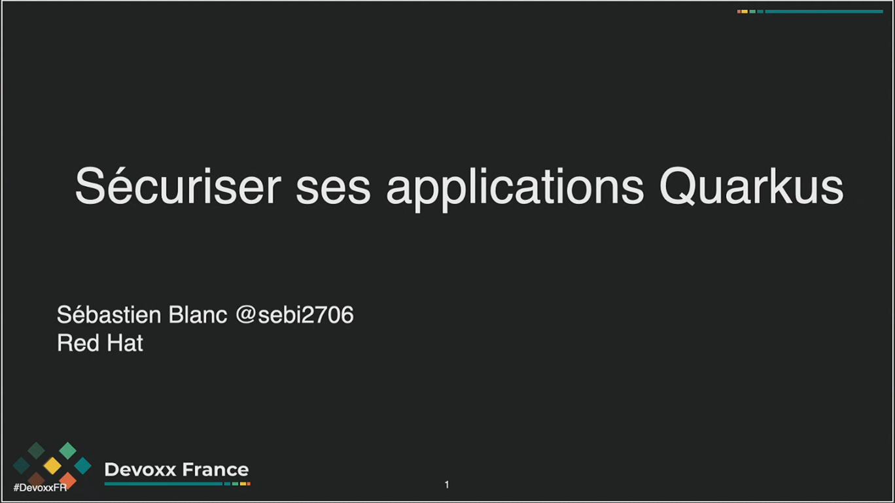
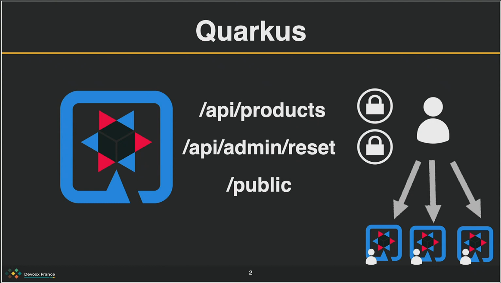
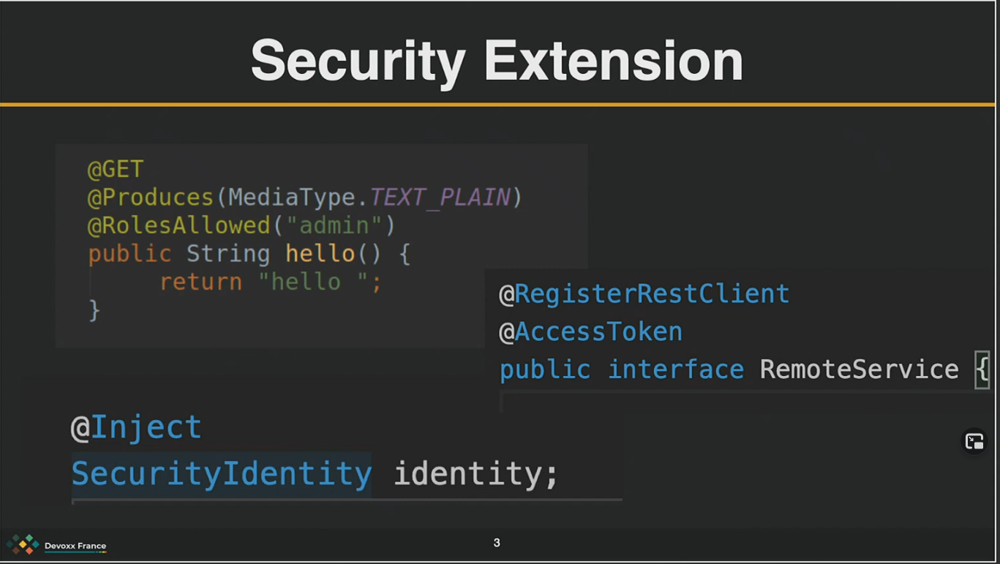
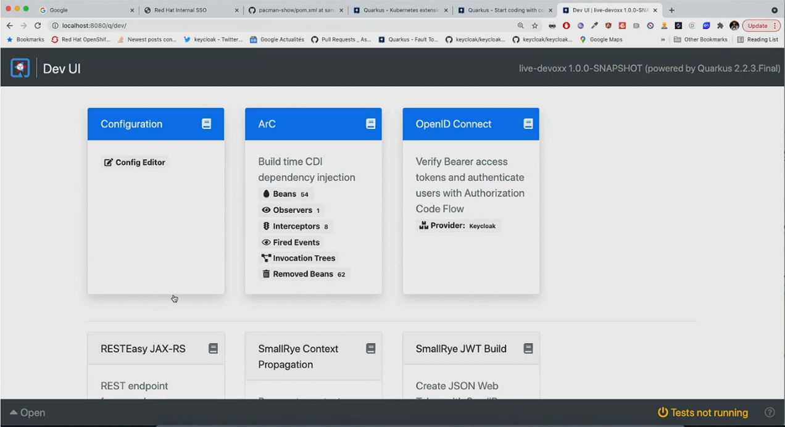

# Sécuriser ses applications Quarkus by Sebastien BLANC

## Track(s): Architecture, Performance et Securité

## Tag(s): OpenID Connect | KeyCloak | security best practices

## Links [description][talk-description] | [video][talk-video]

- Security Extension
  - Annotation classique (@RolesAllowed)
  - Inject SecurityIdentity
  
- LiveCoding (with Keycloak)
  - Quarkus plugin with VSCode
  - devUI
  

## Ce que nous retenons

- Simplicité de dévloppement de service via Quarkus
  - integration de nombreuses extensions pour se concentrer sur la valeur métier de l'application

[talk-description]: https://cfp.devoxx.fr/2021/talk/YAI-2660/Securiser_ses_applications_Quarkus.html
[talk-video]: https://youtu.be/GXd39tCrNI8